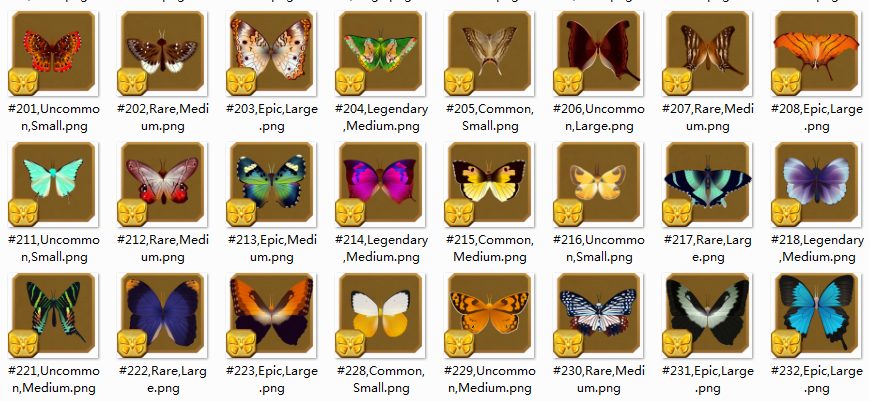

作为自然控+收集控，对flutter的蝴蝶和蛾子游戏没有抵抗力。不过几次更新之后做任务太麻烦，不氪金的话就得花很多时间才能完成，实在没时间做，玩了半年弃坑。

但是其中的蝴蝶还是很好看啊！突然想到可以作为素材来训练模型生成更多蝴蝶，于是行动，写了个脚本爬取flutter-butterfly-sanctuary.wikia的蝴蝶图鉴，并用opencv简单处理下。这是一个游戏玩家志愿做的百科，真辛苦他们了。一共爬了342张。

名字参考意义不大，任务蝶没有地区，所以选择了记录下稀有度和大小作为将来将来训练模型时数据的标签。标签直接作为原始趴下来数据的文件名，用编号区分。

大致思路：
- 使用随机agent伪造浏览器访问
- 先看本地有没有蝴蝶列表记录，没有的话先爬下来所有蝴蝶列表，记录序号、名字、稀有度和大小，存到本地；有的话直接读取
- 根据蝴蝶列表，跳过重复，访问相应的蝴蝶页面，爬蝴蝶照片，
- 出错就重新爬蝴蝶图片
- 将爬下来的图片简单处理下做成数据集

一些解释：
- 蝴蝶图片的url不规律，中间有无规律的数字+字母的字段，没法偷懒使用固定url+名字的方法快速爬，只能一个个访问，所以慢且易出错
- 这个网站访问真的特别慢，浏览器打开（不论翻墙与否）有时候都失败，下载图片也要半天。所以爬虫的偶然性特别大。遂采取了最简单粗暴的发生错误就重爬的策略，一针根治各种连不上、打不开、下不来、被屏蔽问题
- 蝴蝶图片左下角有等级图标盖住了一小部分翅膀，影响整体性，所以裁切只保留右侧，水平翻转再拼接成一只完整蝴蝶。需要注意的是这个裁切和中线有一点点偏差，因为不少蝴蝶在图片中偏右。这样处理结果虽然不完美，但不至于出现明显的两个身子
- 缩放时png透明通道丢失被三次插值补上其他颜色的问题，对整体的影响不大，就不再处理了
